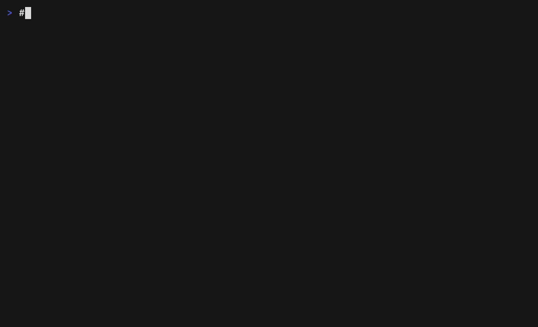

# RegressGuard

[](https://github.com/Bharath-code/regressguard/releases/latest)
[](LICENSE)
[](go.mod)

**Before you commit, know what broke.**

When an AI coding agent edits your app it can silently break an API contract — a removed field, a changed status code, a test that now fails — and still report success. RegressGuard records a known-good baseline and tells you (or the agent) exactly what regressed.

**It is built to live inside the agent's own loop.** RegressGuard ships as an [MCP](https://modelcontextprotocol.io) server, so agents like Claude Code and Cursor can verify their own work and self-correct *before* a human ever sees the diff — zero extra steps. The same engine also runs as a plain CLI for humans and CI.

```
# Agent-native (primary): the agent calls these as MCP tools in its loop
check → status                  # see "Agent-native verification (MCP)" below
                                 # the baseline stays yours: agents cannot re-record it

# Human / CI (also works): two commands, no test-writing, under 15 seconds
regressguard snapshot   # record the known-good state
regressguard check      # compare after edits — see what broke
```



*Break → detect → fix → green. Reproduce it yourself: `./demo/demo.sh`.*

---

## Install

**macOS / Linux (recommended)**

```sh
curl -fsSL https://raw.githubusercontent.com/Bharath-code/regressguard/main/install.sh | sh
```

**Verify**

```sh
regressguard version   # first line must say "RegressGuard"
```

> **Upgrading from v0.1.x?** The binary was renamed from `rg` to `regressguard` because `rg`
> collides with ripgrep. There is no `rg` shim and the old `rg upgrade` can't fetch v0.2.0:
> re-run the installer, delete the old `rg`, then run `regressguard hook install`
> (old hooks call `rg`; `regressguard doctor` flags them).

---

## Quickstart (3 minutes)

### 1. Initialize your project

```sh
cd your-project
regressguard init
```

RegressGuard detects your test command, framework, and dev server URL automatically.

### 2. Record the baseline before your AI session

Make sure your dev server is running, then:

```sh
regressguard snapshot
```

Output:

```
Snapshot

OK Tests       42 passed, 0 failed       6.8s
OK Routes      6 captured, 2 skipped
OK Schemas     6 hashed

Saved:
  .regressguard/snapshot.json

Next:
  Ask your AI agent to make the code change, then run:
  regressguard check
```

### 3. Run your AI agent

Let Claude Code, Cursor, or Codex make its changes.

### 4. Check for regressions before committing

```sh
regressguard check
```

**Clean — safe to commit:**

```
Check

OK No regressions detected

  Tests       42 passed, 0 failed
  Routes      6 unchanged
  Timing      within tolerance

Safe to commit.
```

**Regression found — commit blocked:**

```
Check

X 2 regressions detected

  Route                                 Before    After     Change
  GET /api/users                        schema    schema    schema
    - role (string, removed)
    + age (number, added)
  POST /api/user/update                 200       500       status

Likely cause:
  Auth/session behavior or routing changed during the last code edit.

Changed files since snapshot:
  app/api/users/route.ts
  internal/auth/session.go

Next:
  regressguard check --verbose
  git diff

Commit blocked.
```

Exit code `1` on critical — works with git hooks and CI.

---

## Git Hook (auto-protect every commit)

```sh
regressguard hook install
```

Now `regressguard check` runs automatically before every `git commit`. When a critical regression is detected, the commit is blocked with a compact output:

```
RegressGuard pre-commit

X 1 regression detected
  POST /api/user/update status changed from 200 to 500

Run:
  regressguard check --verbose

Commit blocked. Use --no-verify only if you accept the risk.
```

Bypass with `git commit --no-verify` only when you accept the risk.

---

## Agent-native verification (MCP)

This is RegressGuard's primary mode. Instead of waiting for a human to run `regressguard check`, the AI agent calls it **as a tool inside its own edit loop** — so it catches and fixes regressions it just introduced, before handing the change back to you.

Start the server (stdio transport):

```sh
regressguard mcp serve
```

**Register with Claude Code:**

```sh
claude mcp add regressguard -- regressguard mcp serve
```

**Register with Cursor** (`.cursor/mcp.json`):

```json
{
  "mcpServers": {
    "regressguard": { "command": "regressguard", "args": ["mcp", "serve"] }
  }
}
```

The agent then has two tools:

| Tool | Purpose |
|---|---|
| `check` | Compare current state against the snapshot; returns structured findings with severity |
| `status` | Sub-second health check (snapshot age, route/config/hook status) — no tests run |

**The baseline is human-owned.** Agents get no `snapshot` tool by default. If they
could re-record the baseline, an agent could accept its own regression
(`check` fails → `snapshot` → `check` passes). You record the baseline with
`regressguard snapshot`. To let agents re-baseline anyway, set this in
`.regressguard/config.json` and restart the MCP server:

```json
{ "mcp": { "allowSnapshot": true } }
```

Tool responses are the **same machine-readable payload as `regressguard check --json`** — see [`docs/json-contract.md`](docs/json-contract.md). Every tool call is recorded to an append-only audit log under `.regressguard/` (tool, status, duration, timestamp).

A typical loop: the agent edits code → calls `check` → reads the structured findings → fixes the regression → calls `check` again → only then reports done.

---

## Commands

| Command | Purpose |
|---|---|
| `regressguard init` | Configure RegressGuard for this project |
| `regressguard quickstart` | Auto-configure and snapshot in one command |
| `regressguard snapshot` | Record the current passing state |
| `regressguard check` | Compare current state against the snapshot |
| `regressguard status` | Sub-second health check (snapshot age, routes, hook) — no tests run |
| `regressguard explain <route>` | Show before/after diff for a specific route |
| `regressguard watch` | Watch files and auto-run check on changes |
| `regressguard mcp serve` | Run the MCP server so AI agents can self-verify (see above) |
| `regressguard hook install` | Install the pre-commit git hook |
| `regressguard hook uninstall` | Remove the git hook |
| `regressguard config get <key>` | Read a config value |
| `regressguard config set <key> <value>` | Write a config value |
| `regressguard doctor` | Diagnose setup issues |
| `regressguard upgrade` | Update regressguard to the latest version |
| `regressguard completion <shell>` | Generate shell autocompletions (bash, zsh, fish) |
| `regressguard version` | Print version and build metadata |

Run `regressguard <command> --help` for flags, examples, and exit codes.

---

## Configuration

Config lives in `.regressguard/config.json` (human-readable, git-ignoreable).

```json
{
  "version": 1,
  "testCommand": "npm test",
  "serverUrl": "http://localhost:3000",
  "auth": {
    "mode": "bearer",
    "testToken": "your-test-token",
    "headerName": "Authorization",
    "prefix": "Bearer"
  },
  "ignoreFields": ["requestId", "traceId"],
  "routes": [
    { "method": "GET", "path": "/api/health" },
    { "method": "GET", "path": "/api/users" },
    { "method": "GET", "path": "/api/admin", "skip": true }
  ]
}
```

**Auth modes:** `bearer` (Authorization header), `cookie` (Cookie header), or omit for public routes only.

**ignoreFields:** Fields to exclude from schema comparison — useful for volatile app-specific values like `requestId` or `traceId`.

---

## How it works

1. `regressguard snapshot` runs your test suite and hits each configured route. It records pass/fail counts, HTTP status codes, and a normalized schema hash for each response.

2. `regressguard check` reruns the same tests and routes, then diffs against the snapshot:
   - **CRITICAL**: test suite newly failing, status code changed, response schema changed (e.g. field removed/added/changed)
   - **WARNING**: response time increased >200ms and >50% of baseline
   - **PASS**: everything within acceptable variance

3. Schema comparison automatically normalizes JSON payloads:
   - **Default Dynamic Keys**: Strips 16 common dynamic keys (`id`, `uuid`, `token`, `nonce`, `timestamp`, `createdAt`, `updatedAt`, `deletedAt`, `created_at`, `updated_at`, `deleted_at`, `sessionId`, `accessToken`, `refreshToken`, `expiresAt`, `expires_at`) before hashing.
   - **Pattern Detection**: Automatically detects ISO-8601 date strings, UUIDs, and JWTs, replacing them with generic type representations (`"date"`, `"uuid"`, `"token"`).
   - **User Customization**: Respects custom `ignoreFields` defined in config.

   This ensures the shape integrity of endpoints remains stable across runs even when database IDs and timestamps change.

4. A route whose only change is a non-blocking **WARNING** (e.g. a timing regression) is reported on its own line and is **not** counted in the "Routes: N unchanged" summary or in `summary.passed` of `--json` output.

### Known limitations

These are deliberate trade-offs in v1 — favoring zero false positives over exhaustive detection. They are on the roadmap, not accidental:

- **Test identity comparison is best-effort.** `regressguard check` records failing test *names* (jest, vitest, bun, go test output) and flags a CRITICAL when a test that passed at baseline starts failing — even if the net failure count is unchanged. When names cannot be parsed from your runner's output (or the baseline predates name recording), it falls back to count comparison: a CRITICAL only when the number of failing tests *increases*. Pair `regressguard check` with your normal test runner in CI for exhaustive per-test assertions.
- **Array schemas are inferred from the first element.** The schema normalizer represents a JSON array's shape using its first element. If later elements have a different shape (heterogeneous arrays), that divergence is not reflected in the schema hash and will not be flagged.

---

## Exit codes

| Code | Meaning |
|---|---|
| `0` | Pass or warnings only — safe to commit |
| `1` | Critical regression detected — commit blocked |
| `2` | Usage, config, or runtime error |

---

## Scripting and CI

```sh
# JSON output for scripts and agents
regressguard check --json | jq .status

# Verbose diagnostics on stderr (stdout stays clean JSON)
regressguard check --json --verbose

# Disable color for CI
NO_COLOR=1 regressguard check
```

**GitHub Action** — runs `regressguard check` on every PR and comments the findings:

```yaml
- uses: Bharath-code/regressguard@v0
  with:
    server-command: npm run dev
```

On pull requests the action compares against the snapshot committed on the base branch (`regressguard check --base origin/main`), so a PR that edits `.regressguard/snapshot.json` to hide a regression still fails. Require a human approval when the baseline changes with a CODEOWNERS rule:

```
/.regressguard/snapshot.json  @your-handle
```

Commit `.regressguard/snapshot.json` (`regressguard init` adds `.regressguard/*` + `!.regressguard/snapshot.json` to `.gitignore`); everything else in `.regressguard/` stays local.

See [`action.yml`](action.yml) for all inputs (version pinning, working directory, server URL).

---

## Supported stacks (v1)

- **Frameworks**: Next.js App Router, Express, Hono
- **Test runners**: Vitest, Jest, Bun test, npm test
- **Package managers**: npm, pnpm, yarn, bun
- **Auth**: Bearer token, Cookie header, public routes

Python, FastAPI, and Django support is planned for v2.

---

## Demo fixture

A minimal Next.js API fixture is included in `fixtures/nextjs-app` for demos and testing. See [fixtures/README.md](fixtures/README.md).

---

## Open core

This repo — the CLI and MCP server — is free and MIT, forever. A hosted team layer
(cross-repo dashboard, history retention, compliance export) is scoped in
[`docs/paid-layer-spec.md`](docs/paid-layer-spec.md). Anything that runs on one machine for
one repo stays free; the paid layer is strictly additive.

---

## Changelog

See [CHANGELOG.md](CHANGELOG.md) for release history.

---

## License

MIT — see [LICENSE](LICENSE).

---

*From the same developer as [git-scope](https://github.com/Bharath-code/git-scope).*
